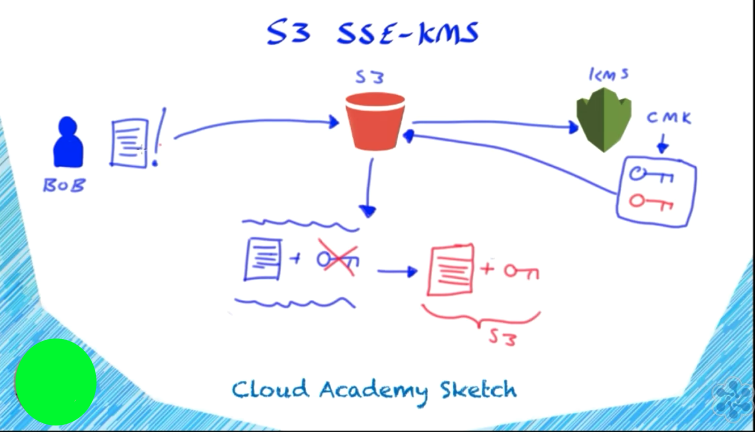
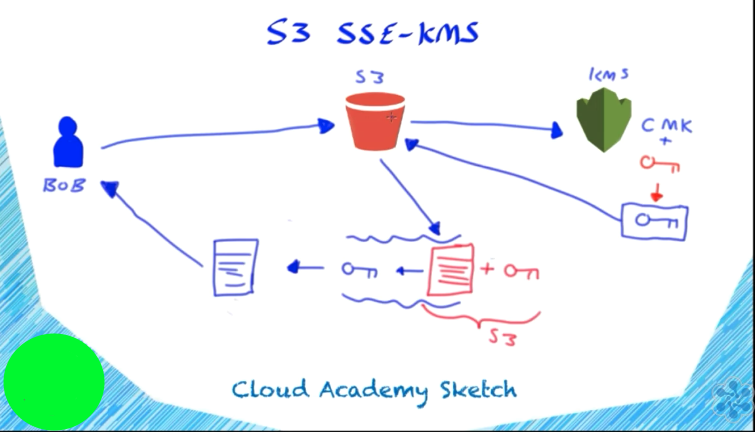

## ML Notes from Cloud Academy Course

1. What is the purpose of dimensionality reduction?

**Answer =>** To promote more insightful visualization of the data
Explanation => If you're not predicting something--if you're just exploring a data set--then there are certain exploratory techniques you might use, one of which is this dimensionality reduction. The role of dimensionality reduction in exploration of data is that, if you have lots of columns that are difficult to visualize, this exploratory stuff here kind of just amounts to visualization. The key part of exploration is visualization. And maybe visualizing data can give you some insight into the problem so you can go back and solve it some other way.

2. K-nearest neighbors algorithms generally produce models that are easy to explain.

Explanation
Do you know what algorithms are easy to explain? We've seen K-nearest neighbors that can be quite easy to explain. It's just that we looked at a database to find the person who was most similar to you.

3. Neural networks generally produce models that are hard to explain.

Explanation
For example, neural networks produce essentially very hard-to-explain models, mainly associative models, typically speaking.

4. In the K-nearest neighbors algorithm, how many options are there for K?
**Answer =>** a number equal to the size of your data set

Explanation
Approach two, the K-nearest neighbors approach, really has an infinite number of options because K can be any number--that is, not any infinite number; it can probably only be within the size of your data set. But there are lots and lots of options there, aren't there? K1, K2, K3, all the way to K equals the number of data points.

5. In Bayesian machine learning, you build the model mostly by hand.

Explanation
There are alternative techniques that are more like genuine statistics--let's say genuine, where the machine isn't doing as much work for you, so to say. That can be sort of helpful with the low-data approach. And those, for example, you would call maybe Bayesian machine learning, and that's where you kind of build a model by hand rather than having the algorithm give you one.

6. If there is a trend between two variables x and y, we say that there is a _____ connection between x and y.

**Answer =>** non-random

7. Explanatory Modelling

The good thing about an explanation or explanatory modeling is that this is modeling where the thing you're tracking, the association you've got, is genuinely causal.

8. What does the "regression" part of logistic regression mean?

**Answer =>** The technique you are using to solve the problem is regression.

9. A merely associative model is usually hard to explain and fails to generalize.

## Probability and statistics

1. In the context of probability and statistics, a **random** variable is one the has variations within the value that are not deterministic.

2. In the context of probability and statistics, the **outcome** of a die is one, two, three, four, five, six.

3. If you are using the following formula to estimate a probability, you are taking a(n) **classical** approach: The probability of event A is the number of elements in A, which is a set of a potential outcomes, divided by the number of elements in all possible outcomes.

4. In a Bayesian system of interpretation, we think of a probabilistic statement as not about events, not about experiments, not about any of that, but about **beliefs**.

5. The **normal distribution** always arises when you have a large enough number of random events.

6. In Bayesian probability, an uninformed probability is known as a(n) **prior**.

7. In Bayesian probability, the most informed probability is known as a(n) **posterior**.

7. In the context of probability and statistics, the idea behind a **density** function is that the mass is spread out across lots of different outcomes and it spreads through a continuous range of outcomes.

## IAM

1. The Access Analyzer is used to generate findings when a policy on a resource within your zone of trust allows access from outside your zone of trust.

2. The initial dashboard of the IAM Console will display the following information. 
    The IAM Resources section provides a summary overview of your IAM resources using a simple count of the number of users, user groups, roles, customer-managed policies, and identity providers you have configured within IAM.

3. In AWS IAM, the **Credential Report** provides a quick and easy way to review your accounts and the last time they were used, in addition to identifying when a user's password was last changed and whether they have Multi-Factor Authentication enabled.

4. 

## KMS

#### You typically use KMS keys in AWS KMS to encrypt your  data encryption keys.

The primary resources in AWS KMS are KMS keys. KMS keys are either customer-managed or AWS-managed. You can use either type of KMS key to protect up to 4 kibibytes (KiB) of data directly. Typically, you use KMS keys to protect data encryption keys (or data keys), which are then used to encrypt or decrypt larger amounts of data outside of the service. KMS keys never leave AWS KMS unencrypted, but data keys can. AWS KMS does not store, manage, or track your data keys.

#### Key material is the secret string of bits used in a cryptographic algorithm. Key material must be kept secret to protect the cryptographic operations that use it.

### S3 SSE KMS Encryption process

1. The end user or client will upload the object to S3, specifying that SSE KMS should be used. 
2. S3 will then contact KMS, and using the specified CMK, it will generate two data keys, a plain text data key and an encrypted version of that data key. 
3. Both of these keys are then sent back to S3, at which point S3 can then encrypt the object that was uploaded, using the plain text data key, to generate an encrypted version of your object. 
4. And then S3 will associate and store the encrypted data key alongside your encrypted object. 

### S3 SSE KMS Decryption process

1. The user will request access to the encrypted object. 
2. S3 will then send the associated encrypted data key to KMS, to generate a plain text version of that encrypted data key, using the associated CMK. 
3. This plain text data key is then sent back to S3. The plain text data key is then used to decrypt the encrypted object, generating a plain text version of the object, which can then be returned to the user. So that's how the encryption process works for S3, SSE KMS.

