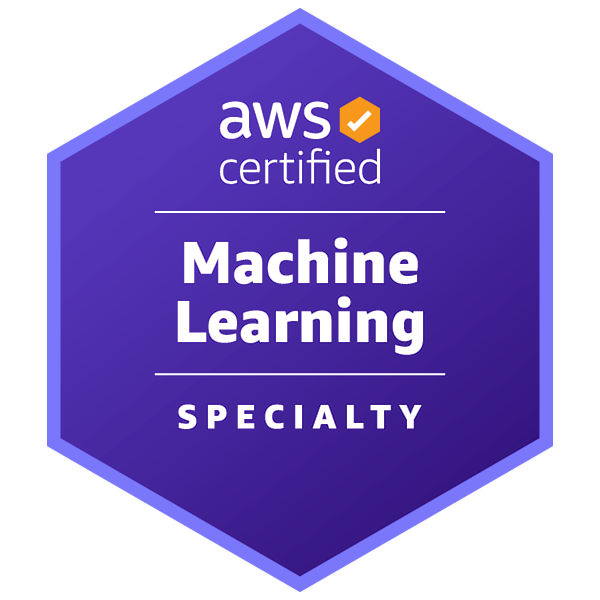

# AWS Certified Machine Learning Certificate 2022

 This repo includes various resources and practice examls that helped me pass the AWS ML Specialty certification in **2022**.

 I passed this exam on 02/07/2022 with score of 818 / 1000 or 81.8%. The passing score is 75%.
 
 Here is my badge.

 

## AWS Certified Machine Learning - Specialty Overview

### Exam Guide (Ref - [AWS_ML_Exam-Guide](https://d1.awsstatic.com/training-and-certification/docs-ml/AWS-Certified-Machine-Learning-Specialty_Exam-Guide.pdf))

**Domain 1: Data Engineering  - 20%**
    1. Data Storoage e.g. - S3
    2. Kinesis Family (Data Streams, Firehose, Analytics, Video Stream)
    3. Data Transformation (ETL) - EMR, Glue, AWSBatch
    4. MapReduce - Hadoop, Spark, Hive
    5. Jobs - Step Functions

**Domain 2: Exploratory Data Analysis  - 24%**
    1. Data Preparation Techniques
    2. Feature Engineering
    3. Data Visualitization and various charts

**Domain 3: Modelling  - 36%**
    1. Supervised/Unsupervised learning, Reinforcement Learning
    2. Types of Algorithms - Regression, Classifications, Forecasting, Clustering, Recommndation
    3. SageMaker Built-in Algorithms
    4. Training Machine Leanring models techniques
    5. Hyperparameter Optimization
    6. Regularization techniques
    7. Various machine learning models evalauation techniques

**Domain 4: Machine Learning Implementation and Operations  - 20%**
    1. AWS Logging - CloudWatch and CloudTrail
    2. AWS Security - IAM, VPC, Encryption/Decryption, security groups, S3 bucket policies
    3. Deployment of ML models - exposing endpoints, production variants, pipeline inference, A/B testing
    4. Other important AWS AI services - 
        - Polly, Lex, Transcribe, Comprehend, Translator
        - AWS Model Monitor, AWS Debugger

### Exam Overview

**Level:** Specialty
**Length:** 180 minutes to complete the exam
**Cost:** 300 USD 

## Resources

1. Udemy Course by Stephane Maarek and Frank Kane
https://www.udemy.com/course/aws-machine-learning/
    - [Udemy AWS ML Slides](Udemy/AWSCertifiedMLSlides.pdf)

2. Whizlab
https://www.whizlabs.com/learn/course/aws-certified-machine-learning-specialty/281

3. An Awesome Github repo 
https://github.com/FabG/ml-aws-specialty-lab
You can refer this repo for various other courses and practice exams which are very useful.

4. My Cheat Sheet
    - [General ML Notes](General_ML_Notes.md)
    - [AWS ML Cheatsheet](AWS_ML_CheatSheet.md)

5. **Others**

    - [AWS Training and Certification](https://www.aws.training/) - this is where you can take the free quiz
    - [Amazon SageMaker Developer guide](https://docs.aws.amazon.com/sagemaker/latest/dg/sagemaker-dg.pdf)

## Practice Exams

### Module quiz
 - [whizlabs Core ML Concepts exam](whizlabs/PracticeExams/Core_Concepts_quiz.pdf)
 - [whizlabs Data Engineering exam](whizlabs/PracticeExams/Data_Engineering_quiz.pdf)
 - [whizlabs EDA exam](whizlabs/PracticeExams/EDA_quiz.pdf)
 - [whizlabs Modelling exam](whizlabs/PracticeExams/Modelling_quiz.pdf)
 - [whizlabs Implementation exam](whizlabs/PracticeExams/Implementation_quiz.pdf)

### Full Exam
 - [whizlabs practice exam 1](whizlabs/PracticeExams/Whizlabs_full_test_1.pdf)
 - [whizlabs practice exam 2](whizlabs/PracticeExams/Whizlabs_full_test_2.pdf)
 - [whizlabs practice exam 3](whizlabs/PracticeExams/Whizlabs_full_test_3.pdf)

## My Certificate

 
